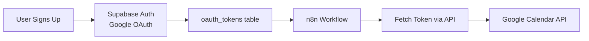
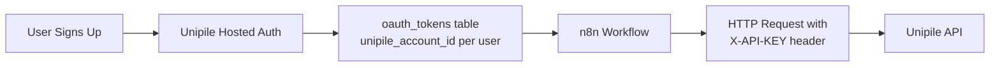

# Google Calendar Migration to Unipile - Outsourcing Project Description

## Project Overview

Migrate 5 Google Calendar tool workflows in the **Multitenant folder** on n8n Cloud from Supabase Auth + Google OAuth to Unipile API. This is part of a larger migration from Google's direct APIs to Unipile's unified API for a multi-tenant SaaS application.

## Background

The application is a multi-tenant SaaS platform that processes emails and automates calendar event and task creation. The application uses:

- **Next.js frontend** on Railway
- **n8n Cloud workflows** for automation
- **Supabase** for database and auth
- **AI agents** for content processing

### Current Architecture (Google OAuth)



**Current Flow:**

1. User authenticates via Supabase Auth (Google OAuth provider)
2. OAuth tokens stored in `oauth_tokens` table (access_token, refresh_token)
3. n8n workflows fetch tokens via `/api/auth/tokens` endpoint
4. Workflows use Google Calendar API directly with OAuth tokens
5. Token refresh logic handled by Supabase Auth

### Target Architecture (Unipile)



**Target Flow:**

1. User authenticates via Unipile (OAuth handled by Unipile)
2. Unipile returns `account_id` which is stored in `oauth_tokens` table per user
3. n8n workflows fetch user's `account_id` from database
4. Workflows make API calls to Unipile (refer to Unipile documentation for API details)
5. No token refresh needed (Unipile manages OAuth internally)

## Scope of Work

### In Scope: Migrate 5 Calendar Workflows

You will migrate these 5 n8n subworkflow tools from Google Calendar API to Unipile API. These workflows are located in the **Multitenant folder** on n8n Cloud:

1. **Calendar_Create_Multitenant** - Creates new calendar events

   - Current: Uses Google Calendar native node or HTTP Request to Google API
   - Target: HTTP Request to `POST /accounts/{accountId}/events`
   - Handles: Event title, start/end times, description, location, RRULE recurrence
   - Test scenarios: Regular events, recurring events, all-day events

2. **Calendar_Update_Multitenant** - Updates existing calendar events

   - Current: Uses Google Calendar API PATCH
   - Target: HTTP Request to `PATCH /accounts/{accountId}/events/{id}`
   - Handles: Modifying event fields (summary, times, description, location, recurrence)
   - Test scenarios: Update regular events, update recurring events, update all-day events

3. **Calendar_Delete_Multitenant** - Deletes calendar events

   - Current: Uses Google Calendar API DELETE
   - Target: HTTP Request to `DELETE /accounts/{accountId}/events/{id}`
   - Handles: Removing events by ID
   - Test scenarios: Delete regular events, delete recurring events (single vs all), delete all-day events

4. **Calendar_By_Date_Multitenant** - Gets events by date range

   - Current: Google Calendar API with date filters
   - Target: HTTP Request to `GET /accounts/{accountId}/events?start_min={date}&start_max={date}`
   - Handles: Date range queries
   - Test scenarios: Single day, date ranges, events spanning multiple days

5. **Calendar_Search_Multitenant** - Searches calendar events

   - Current: Google Calendar API with complex queries
   - Target: HTTP Request to `GET /accounts/{accountId}/events` with filters
   - Handles: Keyword-style text search with date constraints
   - **Special requirements**:
     - Search must operate within **15 days back and 60 days out** from current date
     - **Return only the FIRST event** from results
     - **Include recurrence information** in the returned event
   - May require custom logic design to enforce date range constraints
   - Test scenarios: Keyword search, date range filtering, combined filters, events with recurrence

### Key Requirements

#### 1. Multi-Tenant Support

- Each workflow must support multiple users
- User identification via `user_id` passed as input
- Fetch correct Unipile token per user from Supabase

#### 2. Account ID Retrieval Pattern

Each workflow must:

- Accept `user_id` as input
- Query database (Supabase) for that user's Unipile `account_id`
- Use the `unipile_account_id` in API requests according to Unipile documentation
- Handle missing account_id gracefully (return actionable error)

**Authentication Model:**

- Refer to Unipile documentation for authentication requirements
- Per-user `account_id` is stored in database (identifies which user's calendar to access)
- Unipile manages OAuth tokens internally

**For testing:** You can mock the account_id lookup with hardcoded values in your test environment

#### 3. API Integration Pattern

- Use HTTP Request nodes (not native nodes)
- Base URL: `https://api.unipile.com/v1` (or your specific DSN from Unipile dashboard)
- Authentication: `X-API-KEY` header with YOUR application's Unipile API Key (from environment variable)
- Account specification: Include user's `account_id` in URL path (e.g., `/accounts/{account_id}/events`)
- Handle Unipile API response format
- Return data in format compatible with existing tool schema

4. Error Handling - Actionable Messages for AI Agent

All error messages must be **actionable** - tell the AI agent exactly what's wrong and how to fix it.

**Error Message Format:**

```json
{
  "error": true,
  "message": "Invalid date format for 'start' field. Expected ISO 8601 format like '2025-12-05T09:00:00-08:00' but received '12/05/2025'.",
  "field": "start",
  "received": "12/05/2025",
  "expected_format": "ISO 8601 (YYYY-MM-DDTHH:mm:ss±HH:mm)",
  "example": "2025-12-05T09:00:00-08:00"
}
```

**Required Error Scenarios:**

1. **Wrong Date Format**

   - Message: "You sent the wrong date format for field '{field}'. It should be ISO 8601 format like this: '2025-12-05T09:00:00-08:00'. You sent: '{received_value}'."

2. **Missing Required Field**

   - Message: "Missing required field '{field}'. It needs to be in {data_type} format. Example: '{example_value}'."
   - Example: "Missing required field 'summary'. It needs to be in string format. Example: 'Team Meeting'."

3. **Missing Optional Field (when needed)**

   - Message: "Field '{field}' is missing. If you don't have a value, enter the text 'null'."

4. **Wrong Data Type**

   - Message: "Field '{field}' must be a {expected_type}. You sent: {actual_type}. Example: '{example_value}'."

5. **Invalid Timezone**

   - Message: "Timezone must be 'America/Los_Angeles'. You sent: '{received_timezone}'."

6. **Invalid RRULE**

   - Message: "Invalid recurrence rule. Expected format: 'FREQ=WEEKLY;BYDAY=MO,WE,FR;COUNT=10'. You sent: '{received_rrule}'. Do not include 'RRULE:' prefix."

7. **Unipile API Errors**

   - 401: "Authentication failed. Unipile access token is invalid or expired for user '{user_id}'."
   - 403: "Permission denied. User does not have access to this calendar."
   - 404: "Event not found. Event ID '{event_id}' does not exist for this user."
   - 500: "Unipile API error: {error_details}. Please try again or contact support."

8. **Timeout Errors**

   - Message: "Request to Unipile API timed out after 30 seconds while {operation} for user '{user_id}'. This request will be retried automatically (attempt {retry_count} of 3)."
   - On final retry failure: "Request to Unipile API failed after 3 attempts. Operation: {operation}. Last error: Timeout after 30 seconds. Please try again later or contact support if this persists."

9. **Missing account_id Error**

   - Message: "No Unipile account_id found for user '{user_id}'. User needs to connect their Google Calendar through the app's connection flow."

10. **Unipile API Errors**

   - Refer to Unipile documentation for error codes
   - Translate Unipile errors into actionable messages for the AI agent
   - Include what went wrong and how to fix it

**Error Handling Implementation:**

- Validate all input fields before making Unipile API call
- Return clear, actionable error messages
- Include examples in error messages
- Specify exact format expectations
- Tell agent what to do with null/missing values
- Implement timeout and retry logic (see Timeout Handling section below)

#### 5. Timeout Handling & Retry Logic

**Requirements:**

- **Timeout Duration**: 30 seconds for all Unipile API requests
- **Retry Strategy**: 2-3 retries with exponential backoff
- **Backoff Schedule**:
  - Attempt 1: Immediate (0s wait)
  - Attempt 2: Wait 2 seconds, then retry
  - Attempt 3: Wait 5 seconds, then retry
  - Attempt 4: Wait 10 seconds, then retry (optional 3rd retry)
  - After all attempts fail: Return error to agent

**Implementation Pattern (n8n):**

Use HTTP Request node with:

- **Timeout**: 30000ms (30 seconds)
- **Retry on Fail**: Enabled
- **Max Retries**: 3
- **Retry Interval**: 2000ms (will increase with backoff)

**Timeout Error Messages:**

During retry:

```json
{
  "info": "Request timed out after 30 seconds. Retrying... (attempt 2 of 3)",
  "operation": "create_event",
  "user_id": "abc123"
}
```

After all retries fail:

```json
{
  "error": true,
  "message": "Request to Unipile API failed after 3 attempts. Operation: create_event. Last error: Timeout after 30 seconds. Please try again later or contact support if this persists.",
  "operation": "create_event",
  "user_id": "abc123",
  "attempts": 3,
  "last_error": "timeout"
}
```

**What NOT to worry about:**

- ❌ **5-minute authentication timeout** - This is for initial OAuth setup only, not per-request
- ❌ OAuth flow timeouts - Out of scope (authentication already complete)
- ✅ Only implement 30-second timeout for API operations (create/update/delete/search)

**Test Requirements:**

- Simulate timeout by using invalid/slow endpoint (if possible)
- Verify retry logic executes correctly
- Verify backoff timing (2s, 5s, 10s)
- Verify error message after final failure is actionable

#### 6. Comprehensive Test Plan (REQUIRED)

You must create and execute a comprehensive test plan covering all permutations:

**Create Operation Tests:**

- Create regular event (specific date/time)
- Create recurring event (daily, weekly, monthly patterns)
- Create all-day event (birthdays, holidays)
- Create event with all optional fields (description, location)
- Create event with minimal fields (summary, start, end only)

**Update Operation Tests:**

- Update regular event (change time, title, location)
- Update recurring event (single instance vs all instances)
- Update all-day event
- Convert regular event to recurring
- Convert all-day to timed event

**Delete Operation Tests:**

- Delete regular event
- Delete single instance of recurring event
- Delete all instances of recurring series
- Delete all-day event

**Search Operation Tests:**

- Keyword search within date range (15 days back, 60 days out)
- Search with no results (return appropriate message)
- Search with multiple matches (verify only FIRST event is returned)
- Search result includes recurrence information (if recurring event)
- Search result for non-recurring event (verify no recurrence field or null)
- Verify results exclude events outside date range
- Test date boundary conditions (exactly 15 days back, exactly 60 days out)
- Search with missing/invalid keyword
- Search with special characters in keyword

**By Date Operation Tests:**

- Get events for single day
- Get events for date range (week, month)
- Get events spanning multiple days
- Handle days with no events

**Multi-Tenant Tests:**

- Test all operations with 3+ different mock user IDs
- Demonstrate user isolation logic (each user_id maps to separate Unipile account)
- Document how user_id is used to fetch correct credentials and isolate data

**Error Handling Tests:**

- Missing/invalid user_id
- Invalid event_id
- Invalid date formats (multiple wrong format variations)
- Missing required fields (summary, start, end)
- Missing optional fields (description, location)
- Wrong data types (number instead of string, etc.)
- Invalid timezone formats
- Invalid RRULE formats
- Unipile API errors (401, 403, 404, 500)
- Timeout errors (simulate if possible)

**Incomplete Data Tests (CRITICAL):**

Test incomplete data at two levels:

1. **Agent → Tool (n8n workflow input validation)**

   - Missing `user_id`
   - Missing event title/summary (for create)
   - Missing `start` or `end` time
   - Wrong date format from agent
   - Missing `event_id` (for update/delete)
   - Empty string values vs missing fields
   - Verify tool returns actionable error messages

2. **Tool → Unipile (API request validation)**

   - Incomplete Unipile API request body
   - Missing authentication header
   - Invalid account_id
   - Malformed JSON payload
   - Missing required API fields
   - Verify Unipile error is translated to actionable agent message

#### 7. Unique ID Management

You must specify and implement how event IDs work:

**Google Calendar IDs:**

- Format: `{eventId}` (string from Google)
- Current workflows use these IDs

**Unipile Event IDs:**

- Format: TBD - document what Unipile returns
- May differ from Google Calendar IDs

**Requirements:**

- Document ID format from Unipile API
- Ensure IDs are correctly stored and retrieved
- Handle ID mapping if necessary
- Test ID persistence across operations (create → update → delete)

#### 8. JSON Export & n8n Cloud Compatibility

**Critical requirement**: All workflow JSON must:

- Upload to n8n Cloud without parsing errors
- Follow n8n JSON schema conventions
- Include all required node configuration fields
- Be validated before delivery

**Testing environment:**

- You will validate workflows on your own n8n Cloud instance and Unipile API
- You are responsible for obtaining test access to Unipile API
- JSON export must be production-ready for n8n Cloud import

## What's Provided

### Documentation

- This project requirements document (contains all requirements)
- Current workflow JSON files (contains all technical specifications)
- Unipile API documentation

### Access

**You will provide (your own testing environment):**

- Your own n8n Cloud workspace for development and testing
- Your own Unipile API account with test credentials
- Your own Google Calendar for testing events
- Your own test database (or mock data) for simulating multi-tenant user lookups

**We will provide:**

- Current workflow JSON files from our n8n Cloud (contains all specifications: input/output schemas, field types, database queries, tool descriptions)
- Unipile API documentation
- This project requirements document

**No access needed to:**

- ❌ Our production or staging environments
- ❌ Our Supabase database
- ❌ Our test accounts or credentials
- ❌ Our n8n Cloud workspace (you'll work in your own)

### Reference Files

- Current workflow JSON files (contains complete specifications)
- Unipile API documentation

### Test Data (You Create)

**You will set up your own test data:**

- Your own Google Calendar for testing
- Your own Unipile account with connected Google Calendar
- Mock user IDs for multi-tenant testing (e.g., `test-user-1`, `test-user-2`, `test-user-3`)
- Sample event data for testing (regular, recurring, all-day events)

**All specifications are in the existing workflow JSON files** including data structures, field names, user ID format, and multi-tenant patterns.

## Out of Scope

**You will NOT migrate:**

- Email processing workflows (handled separately)
- Task management workflows (handled separately)
- User onboarding flow (handled separately)
- Frontend OAuth implementation (handled separately)
- Database schema changes (will be provided)
- Webhook setup (handled separately)

## Deliverables

### 1. Updated n8n Workflows (Primary Deliverable)

- 5 working n8n workflow JSON files using Unipile API
- Each JSON file validated and importable to n8n Cloud without errors
- All workflows tested on your own n8n Cloud instance

### 2. Comprehensive Test Plan & Results

**Test Plan Document** (before implementation):

- Complete test matrix covering all permutations (see section above)
- Expected outcomes for each test case
- Test data requirements

**Test Results Document** (after implementation):

- Evidence of successful testing for each test case
- Screenshots or execution logs from n8n Cloud (your test workspace)
- Multi-user test results (3+ mock user IDs demonstrating isolation)
- Edge case testing results
- Any failed tests with explanations
- Video walkthrough of testing (optional but recommended)

### 3. Documentation

**Migration Notes** (per workflow):

- What changed from Google Calendar API to Unipile
- Node-by-node changes
- Any logic additions (e.g., date range filtering for search)

**API Endpoint Mapping:**

- Old Google API endpoint → New Unipile API endpoint
- Request/response format differences
- Authentication changes

**Unique ID Specification:**

- How event IDs are structured in Unipile
- How IDs are stored and retrieved
- Any ID mapping requirements

**Known Issues/Limitations:**

- Any Unipile API limitations discovered
- Workarounds implemented
- Differences in behavior vs Google Calendar

## Success Criteria

### Functional Requirements

- ✅ All 5 workflows execute successfully with Unipile API
- ✅ Multi-tenant support works (tested with 3+ users)
- ✅ RRULE recurring events work correctly (create, update, delete)
- ✅ Timezone handling correct (America/Los_Angeles)
- ✅ All-day events work correctly (create, update, delete)
- ✅ Search operates within 15 days back and 60 days out
- ✅ Search returns only first event with recurrence information included
- ✅ Event IDs work correctly across operations (create → update → delete)
- ✅ Error messages are actionable (tell agent exactly what's wrong and how to fix it)
- ✅ Error messages include format examples and expected values
- ✅ Incomplete data validation works at both Agent→Tool and Tool→Unipile levels
- ✅ 30-second timeout with 2-3 retries and exponential backoff implemented
- ✅ Timeout errors are actionable and inform agent of retry attempts

### Non-Functional Requirements

- ✅ Response time <2 seconds per operation
- ✅ Code follows n8n best practices
- ✅ Workflows use HTTP Request nodes (not native nodes)
- ✅ Token retrieval pattern consistent across all 4 workflows

### Testing Requirements

- ✅ Comprehensive test plan created before implementation
- ✅ All test permutations executed (create/update/delete × regular/recurring/all-day)
- ✅ Tested with real Unipile API (not mocked)
- ✅ Tested with 3+ user accounts (multi-tenant validation)
- ✅ Search date range constraints validated (15 days back, 60 days out)
- ✅ Edge cases validated
- ✅ No breaking changes to tool schema (inputs/outputs match current)
- ✅ JSON files importable to n8n Cloud without errors

## Required Skills

### Must Have

- **n8n Cloud experience** - Must have your own n8n Cloud workspace for development/testing
- **API integration** - Experience with REST APIs, HTTP requests
- **JSON/data transformation** - Mapping between API formats
- **OAuth concepts** - Understanding tokens, credentials
- **Test design** - Ability to create comprehensive test plans with permutations
- **Unipile API access** - Ability to sign up for Unipile and obtain test API credentials
- **Independent testing** - Comfortable setting up your own test environment

### Nice to Have

- Google Calendar API experience (helpful for comparison)
- Supabase/PostgreSQL knowledge
- TypeScript/JavaScript (for expressions in n8n)
- Experience with multi-tenant systems

## Support & Communication

### Available Resources

- Project documentation (provided)
- Unipile API docs (provided)
- Test accounts and credentials
- n8n workspace access

### Communication

- Questions answered within 24 hours
- Weekly progress check-ins
- Screen share sessions available if needed

### Handoff

- Final walkthrough of changes
- Q&A session for edge cases
- Knowledge transfer document

## Unipile API Integration

**Refer to Unipile's official documentation for:**

- API endpoints (base URL, authentication)
- Calendar operations (create, update, delete, search, get by date)
- Request/response formats
- Error handling
- Rate limits and best practices

**Contact Unipile directly for:**

- API support questions
- Authentication issues
- API behavior clarifications
- Latest features and updates

### Special Requirements for Calendar_Search_Multitenant

Implement custom logic to:

1. **Date Range Constraint**: Automatically limit search to 15 days back and 60 days out from current date
2. **Return Only First Event**: From all matching results, return only the first event
3. **Include Recurrence Info**: Ensure the returned event includes recurrence/RRULE data if it's a recurring event

You are responsible for designing and implementing this logic based on Unipile's API capabilities.

**Important:** Only `unipile_account_id` is stored per user. Refer to Unipile documentation for authentication requirements.

### Query Pattern in n8n

```javascript
// Supabase node to fetch user's Unipile account_id
SELECT unipile_account_id 
FROM oauth_tokens 
WHERE user_id = '{{ $json.user_id }}' 
  AND provider = 'unipile'
LIMIT 1
```

Then use the retrieved `account_id` in your Unipile API requests according to Unipile's documentation.

**For your testing:** Mock the account_id lookup with hardcoded values. Use your own Unipile API Key.

## Critical Implementation Notes

### 

### 2. All-Day Events

Handle all-day events (no specific time) according to Unipile API documentation and current workflow specifications.

### 3. RRULE Format

Handle recurring event rules (RRULE) according to Unipile API documentation. Refer to current workflow JSON files for current format requirements.

### 4. Error Response Format - Actionable for AI Agent

**CRITICAL**: All error messages must be actionable - tell the AI agent exactly what's wrong and how to fix it.

**Good Error Message (Actionable):**

```json
{
  "error": true,
  "message": "You sent the wrong date format for 'start' field. It should be ISO 8601 format like this: '2025-12-05T09:00:00-08:00'. You sent: '12/05/2025 9am'.",
  "field": "start",
  "expected_format": "ISO 8601 (YYYY-MM-DDTHH:mm:ss±HH:mm)",
  "example": "2025-12-05T09:00:00-08:00",
  "received": "12/05/2025 9am"
}
```

**Bad Error Message (Not Actionable):**

```json
{
  "error": true,
  "message": "Invalid input",
  "code": "VALIDATION_ERROR"
}
```

**Missing Field Error:**

```json
{
  "error": true,
  "message": "Missing required field 'summary'. It needs to be in string format. Example: 'Team Meeting'.",
  "field": "summary",
  "required": true,
  "data_type": "string",
  "example": "Team Meeting"
}
```

**Null Value Guidance:**

```json
{
  "error": true,
  "message": "Field 'description' is missing. If you don't have a value, enter the text 'null' (as a string).",
  "field": "description",
  "required": false,
  "null_handling": "Enter string 'null' if no value available"
}
```

## Questions to Address

Before starting, please confirm:

1. **n8n Cloud Access**: Do you have your own n8n Cloud workspace (or can you sign up for one)?
2. **Unipile API**: Can you sign up for Unipile and obtain test API credentials?
3. **Independent Setup**: Are you comfortable setting up your own test environment (Google Calendar, Unipile account, test data)?
4. **Availability**: Can you complete this in 3-4 days of focused work?
5. **Testing**: Are you comfortable creating comprehensive test plans and testing with real APIs?
6. **Test Design**: Can you design and implement custom logic (e.g., date range filtering)?
7. **Communication**: Preferred communication method (email, Slack, etc.)?

## Next Steps

If interested:

1. Review the provided documentation
2. Confirm you have the required skills
3. Provide estimated timeline and fixed price
4. Schedule kickoff call to review access and setup