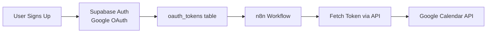

# Complete Unipile Migration - Outsourcing Project Description

## Project Overview

Migrate a multi-user SaaS application from Supabase Auth + Google OAuth to Unipile API. This includes:
- **Frontend**: Authentication and session management changes (4 pages)
- **Workflows**: Onboarding and calendar tool workflows (7 n8n workflows)
- **Backend**: OAuth flow integration and database updates

**Important**: Frontend changes are **authentication/session related only** - no visual redesign or UI/UX changes. Preserve existing look and feel.

## ⚠️ CRITICAL DISCLAIMER

**This specification is an INITIAL APPROACH and should NOT be assumed to be correct.**

You are **responsible** for:
- Reading the complete Unipile API documentation thoroughly
- Verifying all implementation details against Unipile's official docs
- Adjusting your approach based on what Unipile actually supports
- Contacting Unipile support for clarifications
- Making technical decisions based on the latest Unipile capabilities

**This document provides requirements and context, NOT a guaranteed implementation path.** 

If Unipile's API works differently than described here, **follow Unipile's documentation**, not this spec. Document any deviations and explain why Unipile's approach is different/better.

## Background

The application is a multi-user SaaS platform that processes emails and automates calendar event and task creation. The application uses:

- **Next.js frontend** on Railway
- **n8n Cloud workflows** for automation
- **Supabase** for database and auth
- **AI agents** for content processing

### Current Architecture (Google OAuth)



**Current Flow:**

1. User authenticates via Supabase Auth (Google OAuth provider)
2. OAuth tokens stored in `oauth_tokens` table (access_token, refresh_token)
3. n8n workflows fetch tokens via `/api/auth/tokens` endpoint
4. Workflows use Google Calendar API directly with OAuth tokens
5. Token refresh logic handled by Supabase Auth

### Target Architecture (Unipile)

**Complete User Flow (Sign-in Through Onboarding):**

1. **User Initiates Sign-in**
   - User clicks "Sign Up With Google" button on landing page
   - Frontend redirects to auth initiation endpoint

2. **Unipile OAuth Flow**
   - Auth endpoint generates Unipile Hosted Auth link
   - User redirected to Unipile OAuth consent screen
   - User grants email read and full calendar permissions via Google
   - Unipile handles OAuth exchange with Google

3. **OAuth Callback & Account Creation**
   - Unipile redirects back to `/api/auth/callback` with authorization code
   - Callback handler exchanges code for `account_id` from Unipile
   - Store `account_id` in `oauth_tokens` table linked to user
   - Create user session

4. **Post-Authentication Routing**
   - If successful: Redirect to `/whatwefound` page
   - If permissions missing/failed: Redirect to `/auth/missing-permissions` page

5. **Onboarding Workflow Trigger**
   - Callback handler triggers onboarding workflow webhook (n8n)
   - Pass `user_id` and `account_id` to workflow
   - Workflow runs asynchronously while user sees loading state

6. **Onboarding Workflow Execution**
   - Workflow fetches user's `account_id` from database
   - Uses Unipile API to fetch recent emails
   - Processes emails with AI to extract insights
   - Stores results in database

7. **Display Results**
   - `/whatwefound` page queries database for onboarding results
   - Displays processed data to user
   - User can proceed to use the application

**Workflow Integration Pattern (For Calendar Tools):**

1. Calendar tool workflow receives `user_id` as input
2. Query database for user's `account_id` (Unipile account identifier)
3. Make API calls to Unipile using the `account_id`
4. No token refresh logic needed (Unipile manages OAuth internally)


## Scope of Work

### Part 1: Frontend Authentication & Session Changes

Migrate 4 Next.js pages from Supabase Auth (Google OAuth) to Unipile Hosted Auth. **Visual design stays the same** - only authentication and session management changes.

**1. Landing Page** (`app/page.tsx`)
- Current: "Sign in with Google" button using Supabase Auth
- Target: "Connect Calendar" button using Unipile Hosted Auth
- Keep existing design/layout, only swap authentication provider

**2. Auth Callback** (`app/auth/callback/route.ts`)
- Current: Handles Supabase OAuth callback, stores tokens
- Target: Handle Unipile OAuth callback, store `account_id`
- Trigger onboarding workflow webhook after successful auth

**3. Whatwefound Page** (`app/whatwefound/`)
- Current: Uses Supabase session to display user data
- Target: Use Unipile account_id for session management
- Display same data, just fetch using Unipile credentials

**4. Missing Permissions Page** (`app/auth/missing-permissions/page.tsx`)
- Current: Shown when Google OAuth scopes missing
- Target: Shown when Unipile connection fails/missing
- Update messaging and reconnection flow

### Part 2: N8N Workflow Migration

**5-6. Onboarding Workflows**

**Onboarding Workflow** (triggered after sign up)
- Current: Fetches emails via Gmail API, processes with AI
- Target: Fetches emails via Unipile API, processes with AI
- Can be redesigned from scratch if more efficient

**Onboarding Finalize Workflow**
- Current: Completes onboarding, stores results
- Target: Same functionality with Unipile credentials
- Can be redesigned from scratch if more efficient

**7-11. Calendar Tool Workflows** (in Multitenant folder)

Migrate these 5 n8n subworkflow tools from Google Calendar API to Unipile API:

1. **Calendar_Create_Multitenant** - Creates new calendar events

   - Current: Uses Google Calendar native node or HTTP Request to Google API
   - Target: Unipile API (refer to Unipile documentation for endpoint)
   - Handles: Event title, start/end times, description, location, RRULE recurrence
   - **Does NOT handle**: Event attendees (out of scope)
   - Test scenarios: Regular events, recurring events, all-day events

2. **Calendar_Update_Multitenant** - Updates existing calendar events

   - Current: Uses Google Calendar API PATCH
   - Target: Unipile API (refer to Unipile documentation for endpoint)
   - Handles: Modifying event fields (summary, times, description, location, recurrence)
   - Test scenarios: Update regular events, update recurring events, update all-day events

3. **Calendar_Delete_Multitenant** - Deletes calendar events

   - Current: Uses Google Calendar API DELETE
   - Target: Unipile API (refer to Unipile documentation for endpoint)
   - Handles: Removing events by ID
   - Test scenarios: Delete regular events, delete recurring events (single vs all), delete all-day events

4. **Calendar_By_Date_Multitenant** - Gets events by date range

   - Current: Google Calendar API with date filters
   - Target: Unipile API (refer to Unipile documentation for endpoint)
   - Handles: Date range queries
   - Test scenarios: Single day, date ranges, events spanning multiple days

5. **Calendar_Search_Multitenant** - Searches calendar events

   - Current: Google Calendar API with complex queries
   - Target: Unipile API (refer to Unipile documentation for endpoint)
   - Handles: Keyword-style text search with date constraints
   - **Special requirements**:
     - Search must operate within **15 days back and 60 days out** from current date
     - **Return only the FIRST event** from results
     - **Include recurrence information** in the returned event
   - May require custom logic design to enforce these constraints
   - Test scenarios: Keyword search, date range filtering, combined filters, events with recurrence

### Part 3: Backend Integration

**OAuth Flow Implementation**
- Implement Unipile Hosted Auth flow
- Create auth initiation endpoint
- Handle OAuth callback
- Store `account_id` in database
- Trigger onboarding workflow via webhook

**Session Management**
- Update session handling to use `account_id`
- Implement session validation
- Handle session expiration/reconnection

**Database Updates**
- Use `oauth_tokens` table to store `account_id`
- Query pattern to fetch user's Unipile credentials
- Handle legacy Google OAuth data (coexists during migration)

### Key Requirements

#### 1. Multi-Tenant Support

- Each workflow must support multiple users
- User identification via `user_id` passed as input
- Fetch correct Unipile credentials per user from database

#### 2. Account ID Retrieval Pattern

Each workflow must:

- Accept `user_id` as input
- Query database (Supabase) for that user's Unipile `account_id`
- Use the `unipile_account_id` in API requests according to Unipile documentation
- Handle missing account_id gracefully (return actionable error)

**Authentication Model:**

- Refer to Unipile documentation for authentication requirements
- Per-user `account_id` is stored in database (identifies which user's calendar to access)
- Unipile manages OAuth tokens internally

**For testing:** You can mock the account_id lookup with hardcoded values in your test environment

#### 3. API Integration Pattern

- Use HTTP Request nodes (not native nodes)
- Refer to Unipile API documentation for:
  - API endpoints for calendar operations (create, update, delete, search, get by date)
  - Authentication headers
  - Request/response formats
  - Error codes and handling
- Use user's `account_id` retrieved from database to identify which calendar to access
- Return data in format compatible with existing tool schema (see current workflow JSON files)


4. Error Handling - Actionable Messages for AI Agent

All error messages must be **actionable** - tell the AI agent exactly what's wrong and how to fix it.

**Error Message Format:**

```json
{
  "error": true,
  "message": "Invalid date format for 'start' field. Expected ISO 8601 format like '2025-12-05T09:00:00-08:00' but received '12/05/2025'.",
  "field": "start",
  "received": "12/05/2025",
  "expected_format": "ISO 8601 (YYYY-MM-DDTHH:mm:ss±HH:mm)",
  "example": "2025-12-05T09:00:00-08:00"
}
```

**Required Error Scenarios:**

1. **Wrong Date Format**

   - Message: "You sent the wrong date format for field '{field}'. It should be ISO 8601 format like this: '2025-12-05T09:00:00-08:00'. You sent: '{received_value}'."

2. **Missing Required Field**

   - Message: "Missing required field '{field}'. It needs to be in {data_type} format. Example: '{example_value}'."
   - Example: "Missing required field 'summary'. It needs to be in string format. Example: 'Team Meeting'."

3. **Missing Optional Field (when needed)**

   - Message: "Field '{field}' is missing. If you don't have a value, enter the text 'null'."

4. **Wrong Data Type**

   - Message: "Field '{field}' must be a {expected_type}. You sent: {actual_type}. Example: '{example_value}'."

5. **Invalid Timezone**

   - Message: "Timezone must be 'America/Los_Angeles'. You sent: '{received_timezone}'."

6. **Invalid RRULE**

   - Message: "Invalid recurrence rule. Expected format: 'FREQ=WEEKLY;BYDAY=MO,WE,FR;COUNT=10'. You sent: '{received_rrule}'. Do not include 'RRULE:' prefix."

7. **Unipile API Errors**

   - 401: "Authentication failed. Unipile access token is invalid or expired for user '{user_id}'."
   - 403: "Permission denied. User does not have access to this calendar."
   - 404: "Event not found. Event ID '{event_id}' does not exist for this user."
   - 500: "Unipile API error: {error_details}. Please try again or contact support."

8. **Timeout Errors**

   - Message: "Request to Unipile API timed out after 30 seconds while {operation} for user '{user_id}'. This request will be retried automatically (attempt {retry_count} of 3)."
   - On final retry failure: "Request to Unipile API failed after 3 attempts. Operation: {operation}. Last error: Timeout after 30 seconds. Please try again later or contact support if this persists."

9. **Missing account_id Error**

   - Message: "No Unipile account_id found for user '{user_id}'. User needs to connect their Google Calendar through the app's connection flow."

10. **Unipile API Errors**

   - Refer to Unipile documentation for error codes
   - Translate Unipile errors into actionable messages for the AI agent
   - Include what went wrong and how to fix it

**Error Handling Implementation:**

- Validate all input fields before making Unipile API call
- Return clear, actionable error messages
- Include examples in error messages
- Specify exact format expectations
- Tell agent what to do with null/missing values
- Implement timeout and retry logic (see Timeout Handling section below)

#### 5. Timeout Handling & Retry Logic

**Requirements:**

- **Timeout Duration**: 30 seconds for all Unipile API requests
- **Retry Strategy**: 2-3 retries with exponential backoff
- **Backoff Schedule**:
  - Attempt 1: Immediate (0s wait)
  - Attempt 2: Wait 2 seconds, then retry
  - Attempt 3: Wait 5 seconds, then retry
  - Attempt 4: Wait 10 seconds, then retry (optional 3rd retry)
  - After all attempts fail: Return error to agent

**Implementation Pattern (n8n):**

Use HTTP Request node with:
- **Timeout**: 30000ms (30 seconds)
- **Retry on Fail**: Enabled
- **Max Retries**: 3
- **Retry Interval**: 2000ms (will increase with backoff)

**Timeout Error Messages:**

During retry:
```json
{
  "info": "Request timed out after 30 seconds. Retrying... (attempt 2 of 3)",
  "operation": "create_event",
  "user_id": "abc123"
}
```

After all retries fail:
```json
{
  "error": true,
  "message": "Request to Unipile API failed after 3 attempts. Operation: create_event. Last error: Timeout after 30 seconds. Please try again later or contact support if this persists.",
  "operation": "create_event",
  "user_id": "abc123",
  "attempts": 3,
  "last_error": "timeout"
}
```

**What NOT to worry about:**

- ❌ **5-minute authentication timeout** - This is for initial OAuth setup only, not per-request
- ❌ OAuth flow timeouts - Out of scope (authentication already complete)
- ✅ Only implement 30-second timeout for API operations (create/update/delete/search)

**Test Requirements:**

- Simulate timeout by using invalid/slow endpoint (if possible)
- Verify retry logic executes correctly
- Verify backoff timing (2s, 5s, 10s)
- Verify error message after final failure is actionable

#### 6. Comprehensive Test Plan (REQUIRED)

You must create and execute a comprehensive test plan covering all permutations:

**Create Operation Tests:**

- Create regular event (specific date/time)
- Create recurring event (daily, weekly, monthly patterns)
- Create all-day event (birthdays, holidays)
- Create event with all optional fields (description, location)
- Create event with minimal fields (title, start, end only)

**Update Operation Tests:**

- Update regular event (change time, title, location)
- Update recurring event (single instance vs all instances)
- Update all-day event
- Convert regular event to recurring
- Convert all-day to timed event

**Delete Operation Tests:**

- Delete regular event
- Delete single instance of recurring event
- Delete all instances of recurring series
- Delete all-day event

**Search Operation Tests:**

- Keyword search within date range (15 days back, 60 days out)
- Search with no results (return appropriate message)
- Search with multiple matches (verify only FIRST event is returned)
- Search result includes recurrence information (if recurring event)
- Search result for non-recurring event (verify no recurrence field or null)
- Verify results exclude events outside date range
- Test date boundary conditions (exactly 15 days back, exactly 60 days out)
- Search with missing/invalid keyword
- Search with special characters in keyword

**By Date Operation Tests:**

- Get events for single day
- Get events for date range (week, month)
- Get events spanning multiple days
- Handle days with no events

**Multi-Tenant Tests:**

- Test all operations with 3+ different mock user IDs
- Demonstrate user isolation logic (each user_id maps to separate Unipile account)
- Document how user_id is used to fetch correct credentials and isolate data

**Error Handling Tests:**

- Missing/invalid user_id
- Invalid event_id
- Invalid date formats (multiple wrong format variations)
- Missing required fields (summary, start, end)
- Missing optional fields (description, location)
- Wrong data types (number instead of string, etc.)
- Invalid timezone formats
- Invalid RRULE formats
- Unipile API errors (401, 403, 404, 500)
- Timeout errors (simulate if possible)

**Incomplete Data Tests (CRITICAL):**

Test incomplete data at two levels:

1. **Agent → Tool (n8n workflow input validation)**

   - Missing `user_id`
   - Missing event title/summary (for create)
   - Missing `start` or `end` time
   - Wrong date format from agent
   - Missing `event_id` (for update/delete)
   - Empty string values vs missing fields
   - Verify tool returns actionable error messages

2. **Tool → Unipile (API request validation)**

   - Incomplete Unipile API request body
   - Missing authentication header
   - Invalid account_id
   - Malformed JSON payload
   - Missing required API fields
   - Verify Unipile error is translated to actionable agent message

#### 7. Unique ID Management

You must specify and implement how event IDs work:

**Google Calendar IDs:**

- Format: `{eventId}` (string from Google)
- Current workflows use these IDs

**Unipile Event IDs:**

- Format: TBD - document what Unipile returns
- May differ from Google Calendar IDs

**Requirements:**

- Document ID format from Unipile API
- Ensure IDs are correctly stored and retrieved
- Handle ID mapping if necessary
- Test ID persistence across operations (create → update → delete)

#### 8. JSON Export & n8n Cloud Compatibility

**Critical requirement**: All workflow JSON must:

- Upload to n8n Cloud without parsing errors
- Follow n8n JSON schema conventions
- Include all required node configuration fields
- Be validated before delivery

**Testing environment:**

- You will validate workflows on your own n8n Cloud instance and Unipile API
- You are responsible for obtaining test access to Unipile API
- JSON export must be production-ready for n8n Cloud import

## What's Provided

### Documentation

- This project requirements document (contains all requirements)
- Current workflow JSON files (contains all technical specifications)
- Unipile API documentation

### Access & Testing Environment

**You will provide (your own testing environment):**

- Your own n8n Cloud workspace for development and testing
- Your own Unipile API account with test credentials
- Your own Google Calendar for testing events
- Your own test database (or mock data) for simulating multi-tenant user lookups

**We will provide:**

- Current workflow JSON files from our n8n Cloud
- Current Next.js pages (frontend code)
- Technical specifications and requirements

**No access needed to:**

- ❌ Our production or staging environments
- ❌ Our Supabase database
- ❌ Our test accounts or credentials
- ❌ Our n8n Cloud workspace (you'll work in your own)

### Reference Files

- Current workflow JSON files (contains complete specifications)
- Current Next.js page files (frontend code)
- Unipile API documentation

### Test Data (You Create)

**You will set up your own test data:**

- Your own Google Calendar for testing
- Your own Unipile account with connected Google Calendar
- Mock user IDs for multi-tenant testing (e.g., `test-user-1`, `test-user-2`, `test-user-3`)
- Sample event data for testing (regular, recurring, all-day events)

**All specifications are in the existing workflow JSON files** including data structures, field names, user ID format, and multi-tenant patterns.

## Out of Scope

**You will NOT migrate or implement:**

- **Calendar event attendees** - Events do not need attendee management
- Email command processing workflows (handled separately)
- Task management workflows (handled separately)
- Dashboard page (no changes needed)
- Visual design or UI/UX (keep existing)
- Database schema changes (table structure already exists)
- Other unrelated features

**Important**: If you discover other features in the current implementation that are not explicitly mentioned in the scope, they are likely out of scope. When in doubt, ask.

## Deliverables

### 1. Frontend Code (Next.js)

- 4 updated page files with Unipile auth integration
- OAuth flow implementation (auth initiation + callback)
- Session management utilities
- All code deployable to Railway without errors
- **Visual design unchanged** - only auth/session logic changes

### 2. N8N Workflows

- 7 working n8n workflow JSON files using Unipile API
  - 2 onboarding workflows
  - 5 calendar tool workflows
- Each JSON file validated and importable to n8n Cloud without errors
- All workflows tested on your own n8n Cloud instance
- Workflows can be redesigned from scratch if more efficient

### 3. Comprehensive Test Plan & Results

**Test Plan Document** (before implementation):

- Complete test matrix covering all permutations (see section above)
- Expected outcomes for each test case
- Test data requirements

**Test Results Document** (after implementation):

- Evidence of successful testing for each test case
- Screenshots or execution logs from n8n Cloud (your test workspace)
- Multi-user test results (3+ mock user IDs demonstrating isolation)
- Edge case testing results
- Any failed tests with explanations
- Video walkthrough of testing (optional but recommended)

### 4. Documentation

**Migration Notes** (per workflow):

- What changed from Google Calendar API to Unipile
- Node-by-node changes
- Any logic additions (e.g., date range filtering for search)

**API Endpoint Mapping:**

- Old Google API endpoint → New Unipile API endpoint
- Request/response format differences
- Authentication changes

**Specification vs Reality Document:**

- **REQUIRED**: Document any differences between this specification and Unipile's actual API
- Explain why Unipile's approach differs from what was described here
- Justify implementation decisions based on Unipile's documentation
- Note any features described in this spec that Unipile doesn't support

**Unique ID Specification:**

- How event IDs are structured in Unipile
- How IDs are stored and retrieved
- Any ID mapping requirements

**Known Issues/Limitations:**

- Any Unipile API limitations discovered
- Workarounds implemented
- Differences in behavior vs Google Calendar

## Success Criteria

### Functional Requirements

- ✅ Frontend pages work with Unipile auth (login, callback, whatwefound, missing-permissions)
- ✅ OAuth flow successfully stores `account_id` and triggers onboarding
- ✅ Onboarding workflows work with Unipile API
- ✅ All 5 calendar workflows execute successfully with Unipile API
- ✅ Multi-tenant support works (tested with 3+ users)
- ✅ RRULE recurring events work correctly (create, update, delete)
- ✅ Timezone handling correct (America/Los_Angeles)
- ✅ All-day events work correctly (create, update, delete)
- ✅ Search returns only first event with recurrence info
- ✅ Search operates within 15 days back and 60 days out
- ✅ Event IDs work correctly across operations (create → update → delete)
- ✅ Error messages are actionable (tell agent exactly what's wrong and how to fix it)
- ✅ Error messages include format examples and expected values
- ✅ Incomplete data validation works at both Agent→Tool and Tool→Unipile levels
- ✅ 30-second timeout with 2-3 retries and exponential backoff implemented
- ✅ Timeout errors are actionable and inform agent of retry attempts

### Non-Functional Requirements

- ✅ Response time <2 seconds per operation
- ✅ Code follows Next.js and n8n best practices
- ✅ Workflows use HTTP Request nodes (not native nodes)
- ✅ Token retrieval pattern consistent across all workflows

### Testing Requirements

- ✅ Comprehensive test plan created before implementation
- ✅ All test permutations executed (create/update/delete × regular/recurring/all-day)
- ✅ Tested with real Unipile API (not mocked)
- ✅ Tested with 3+ user accounts (multi-tenant validation)
- ✅ Search date range constraints validated (15 days back, 60 days out)
- ✅ Edge cases validated
- ✅ No breaking changes to tool schema (inputs/outputs match current)
- ✅ JSON files importable to n8n Cloud without errors
- ✅ Frontend code deployable to Railway without errors

## Required Skills

### Must Have

- **Next.js experience** - Frontend development with App Router
- **OAuth implementation** - Experience implementing OAuth flows
- **n8n Cloud experience** - Must have your own n8n Cloud workspace for development/testing
- **API integration** - Experience with REST APIs, HTTP requests
- **TypeScript/JavaScript** - Strong proficiency required
- **Session management** - Understanding of authentication and sessions
- **Test design** - Ability to create comprehensive test plans
- **Unipile API access** - Ability to sign up for Unipile and obtain test API credentials
- **Independent testing** - Comfortable setting up your own test environment
- **Full-stack mindset** - Can work across frontend and backend/workflows

### Nice to Have

- Google Calendar API experience (helpful for comparison)
- Supabase/PostgreSQL knowledge
- Railway deployment experience
- Experience with multi-tenant systems
- AI/LLM workflow experience (for onboarding)

## Support & Communication

### Available Resources

- Project documentation (provided)
- Unipile API docs (provided)
- Test accounts and credentials (you create your own)
- Current code and workflow files (provided)

### Communication

- Questions answered within 24 hours
- Weekly progress check-ins
- Screen share sessions available if needed

### Handoff

- Final walkthrough of changes
- Q&A session for edge cases
- Knowledge transfer document

## Unipile API Integration

⚠️ **CRITICAL**: This specification provides a starting point, but **you must verify everything against Unipile's official documentation**. If Unipile's API differs from what's described here, **follow Unipile's documentation**.

**Your responsibilities:**

1. Read Unipile's complete API documentation before starting
2. Verify all endpoints, authentication methods, and data formats
3. Test with Unipile's API to understand actual behavior
4. Document any differences between this spec and Unipile's actual API
5. Make implementation decisions based on Unipile's capabilities, not assumptions in this spec

**Refer to Unipile's official documentation for:**

- API endpoints (base URL, authentication)
- Calendar operations (create, update, delete, search, get by date)
- Request/response formats
- Error handling
- Rate limits and best practices
- OAuth flow implementation details

**Contact Unipile directly for:**

- API support questions
- Authentication issues
- API behavior clarifications
- Latest features and updates
- Best practices for calendar integration

### Special Requirements for Calendar_Search_Multitenant

Implement custom logic to:

1. **Date Range Constraint**: Automatically limit search to 15 days back and 60 days out from current date
2. **Return Only First Event**: From all matching results, return only the first event
3. **Include Recurrence Info**: Ensure the returned event includes recurrence/RRULE data if it's a recurring event

You are responsible for designing and implementing this logic based on Unipile's API capabilities.

**Important:** Only `unipile_account_id` is stored per user. Refer to Unipile documentation for authentication requirements.

### Query Pattern in n8n

```javascript
// Supabase node to fetch user's Unipile account_id
SELECT unipile_account_id 
FROM oauth_tokens 
WHERE user_id = '{{ $json.user_id }}' 
  AND provider = 'unipile'
LIMIT 1
```

Then use the retrieved `account_id` in your Unipile API requests according to Unipile's documentation.

**For your testing:** Mock the account_id lookup with hardcoded values. Use your own Unipile API Key.

## Critical Implementation Notes

### 

### 2. All-Day Events

Handle all-day events (no specific time) according to Unipile API documentation and current workflow specifications.

### 3. RRULE Format

Handle recurring event rules (RRULE) according to Unipile API documentation. Refer to current workflow JSON files for current format requirements.

### 4. Error Response Format - Actionable for AI Agent

**CRITICAL**: All error messages must be actionable - tell the AI agent exactly what's wrong and how to fix it.

**Good Error Message (Actionable):**

```json
{
  "error": true,
  "message": "You sent the wrong date format for 'start' field. It should be ISO 8601 format like this: '2025-12-05T09:00:00-08:00'. You sent: '12/05/2025 9am'.",
  "field": "start",
  "expected_format": "ISO 8601 (YYYY-MM-DDTHH:mm:ss±HH:mm)",
  "example": "2025-12-05T09:00:00-08:00",
  "received": "12/05/2025 9am"
}
```

**Bad Error Message (Not Actionable):**

```json
{
  "error": true,
  "message": "Invalid input",
  "code": "VALIDATION_ERROR"
}
```

**Missing Field Error:**

```json
{
  "error": true,
  "message": "Missing required field 'summary'. It needs to be in string format. Example: 'Team Meeting'.",
  "field": "summary",
  "required": true,
  "data_type": "string",
  "example": "Team Meeting"
}
```

**Null Value Guidance:**

```json
{
  "error": true,
  "message": "Field 'description' is missing. If you don't have a value, enter the text 'null' (as a string).",
  "field": "description",
  "required": false,
  "null_handling": "Enter string 'null' if no value available"
}
```

## Questions to Address

Before starting, please confirm:

1. **Next.js & n8n Cloud Access**: Do you have experience with both Next.js and n8n Cloud (or can you learn quickly)?
2. **Unipile API**: Can you sign up for Unipile and obtain test API credentials?
3. **Independent Setup**: Are you comfortable setting up your own test environment (Next.js app, Google Calendar, Unipile account)?
4. **Availability**: Can you commit 2.5-4 weeks of focused work on this project?
5. **Full-Stack Experience**: Are you comfortable working across frontend (Next.js) and backend/workflows (n8n)?
6. **OAuth Implementation**: Have you implemented OAuth flows before?
7. **Testing**: Are you comfortable creating comprehensive test plans and testing end-to-end flows?
8. **Communication**: Preferred communication method (email, Slack, etc.)?
9. **Portfolio**: Can you share examples of similar migration projects?

## Next Steps

If interested:

1. Review the provided documentation
2. Confirm you have the required skills
3. Provide estimated timeline and fixed price
4. Schedule kickoff call to review access and setup

---

**Project Type**: Fixed scope, comprehensive migration

**Complexity**: Medium-High (frontend + workflows, OAuth implementation, multi-tenant)

**Risk**: Medium (OAuth flow critical, end-to-end integration required)

**Best For**: Experienced full-stack developer with OAuth and workflow automation experience
