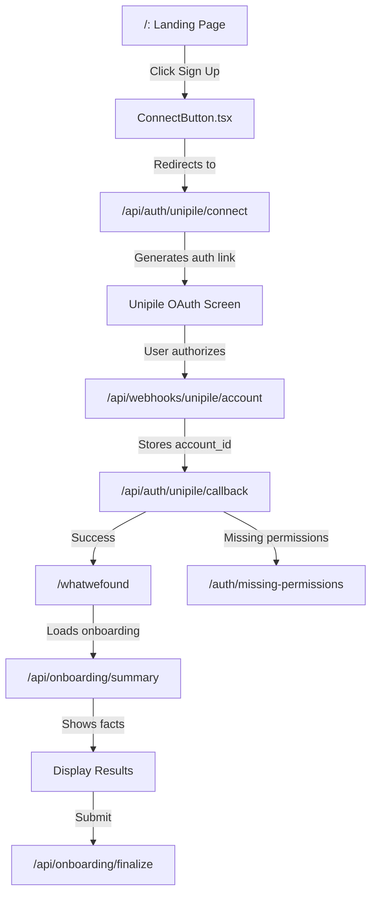

# User Flow Documentation

This document describes the complete user journey through the authentication and onboarding process on bippity.boo.

## Flow Diagram



## Detailed Step-by-Step Flow

### Step 1: Landing Page
**File:** `pages/landing-page.tsx`

- User visits `https://bippity.boo/`
- Sees hero section with value proposition
- Landing page features:
  - Hero section with "Sign Up With Google" CTA
  - Feature descriptions
  - Pricing/roadmap section
  - Privacy information

### Step 2: User Initiates Sign-Up
**File:** `components/ConnectButton.tsx`

- User clicks "Sign Up With Google" button
- Component redirects to `/api/auth/unipile/connect`
- Shows loading state during redirect

### Step 3: Generate Unipile OAuth Link
**File:** `api-routes/auth/unipile-connect.ts`

**What happens:**
1. Generates a unique `session_id` (UUID)
2. Calls Unipile API endpoint: `POST /api/v1/hosted/accounts/link`
3. Configures:
   - Provider: GOOGLE
   - Success redirect: `/api/auth/unipile/callback?session_id={id}`
   - Failure redirect: `/?error=oauth_failed`
   - Webhook URL: `/api/webhooks/unipile/account`
4. Stores `session_id` in cookie (10 min expiry)
5. Redirects user to Unipile's hosted OAuth screen

**Environment Variables Used:**
- `UNIPILE_DSN` - Unipile API endpoint
- `UNIPILE_API_KEY` - Application API key
- `NEXT_PUBLIC_APP_URL` - Application base URL

### Step 4: User Authorizes on Unipile
**External:** Unipile OAuth screen

- User sees Unipile's OAuth consent screen
- Grants Gmail read and Calendar full access
- Unipile completes OAuth exchange with Google

### Step 5: Webhook Receives Account Creation
**File:** `api-routes/webhooks/unipile-account.ts`

**Triggered by:** Unipile after successful OAuth

**What happens:**
1. Receives webhook with `account_id`, `provider_email`, and `name` (session_id)
2. Creates temporary record in `oauth_tokens` table:
   - `user_id`: `pending_{session_id}`
   - `provider`: `unipile`
   - `unipile_account_id`: from webhook
   - `provider_email`: user's email
3. This allows callback route to find the account_id

### Step 6: OAuth Callback Processing
**File:** `api-routes/auth/unipile-callback.ts`

**Triggered by:** Unipile redirect after authorization

**What happens:**
1. Extracts `session_id` from URL or cookie
2. Polls database for `pending_{session_id}` record (max 10 retries with exponential backoff)
3. Once found:
   - Retrieves `unipile_account_id` from temporary record
   - Fetches user email from Unipile API (if not in webhook)
   - Creates Supabase user account (if new user):
     - Email: from Unipile account
     - Auto-confirmed (bypasses email verification)
     - Metadata: provider = 'unipile'
   - Updates `oauth_tokens` with real user_id (replaces pending record)
4. Triggers n8n onboarding workflow via webhook
5. Redirects to `/whatwefound`

**Database Operations:**
- Lookup: `oauth_tokens WHERE user_id = 'pending_{session_id}'`
- Delete: pending record
- Insert: final record with real user_id

**N8N Workflow Triggered:**
- Endpoint: `N8N_UNIPILE_ONBOARDING_WEBHOOK_URL`
- Payload: `{ userId, email, fullName }`

### Step 7: Whatwefound Page (Onboarding Results)
**File:** `pages/whatwefound-page.tsx`

**What happens:**
1. **Loading State (0-3 minutes):**
   - Shows animated progress bar
   - Displays current stage ("Connecting to Gmail...", "Searching for keywords...", etc.)
   - Shows random tips from `/api/onboarding/tip`
   - Polls `/api/onboarding/summary` every 3 seconds

2. **Polling for Results:**
   - Calls `/api/onboarding/summary?session_id={id}` (if available)
   - Continues until `summary_sentences` array is populated
   - Timeout after 3 minutes if no results

3. **Display Results:**
   - Shows extracted facts grouped by first word
   - Example: "Sara does soccer on Saturdays", "Mike checked in at 8:05 AM"
   - Provides textarea for corrections/additions
   - Two submit options:
     - "Looks Good!" (no corrections)
     - "Submit Edits" (with corrections)

4. **Finalize Onboarding:**
   - Calls `/api/onboarding/finalize` with facts and user edits
   - Waits up to 60 seconds for confirmation
   - Shows success message on completion

**Edge Cases Handled:**
- No account found → shows timeout state with manual input form
- No facts extracted → shows "didn't find much yet" with manual input
- Account status polling → handles session without cookies

### Step 8: Missing Permissions (Error Path)
**File:** `pages/missing-permissions-page.tsx`

**When triggered:**
- User denies OAuth permissions
- Insufficient scopes granted
- OAuth flow fails

**What it shows:**
- Error message explaining what went wrong
- Instructions to try again
- Link back to landing page

## API Endpoints Summary

### Authentication
- `POST /api/auth/unipile/connect` - Generate Unipile auth link
- `GET /api/auth/unipile/callback` - Process OAuth callback
- `GET /api/auth/unipile/check-status` - Poll for account creation status

### Onboarding
- `GET /api/onboarding/summary` - Fetch extracted facts
- `POST /api/onboarding/finalize` - Save final facts and user edits
- `GET /api/onboarding/tip` - Get random onboarding tip

### Webhooks
- `POST /api/webhooks/unipile/account` - Receive account creation events

## Session & Cookie Management

**Middleware:** `lib/middleware.ts`
- Runs on every request except static assets
- Refreshes Supabase session if expired
- Sets cookies with domain `.bippity.boo` for cross-subdomain access

**Cookie Configuration:** `lib/cookie-utils.ts`
- Domain: `.bippity.boo`
- HttpOnly: `true` (production)
- Secure: `true` (production)
- SameSite: `lax`

## Database Schema Reference

### `oauth_tokens` table
```sql
CREATE TABLE oauth_tokens (
  user_id TEXT PRIMARY KEY,
  provider TEXT NOT NULL,
  unipile_account_id TEXT,
  provider_email TEXT,
  created_at TIMESTAMPTZ DEFAULT NOW(),
  updated_at TIMESTAMPTZ DEFAULT NOW()
);
```

### `onboarding_summaries` table
```sql
CREATE TABLE onboarding_summaries (
  id UUID PRIMARY KEY DEFAULT gen_random_uuid(),
  user_id UUID REFERENCES auth.users(id),
  summary_sentences TEXT[],
  user_edits TEXT,
  created_at TIMESTAMPTZ DEFAULT NOW(),
  updated_at TIMESTAMPTZ DEFAULT NOW()
);
```

## Error Handling

### OAuth Errors
- Handled in landing page via URL parameters (`?error=...`)
- Displays toast notification with user-friendly message
- Cleans URL after displaying error

### API Errors
- All API routes use `neverError: true` in HTTP requests
- Errors returned as JSON with `success: false` and `error` message
- Frontend checks for error responses and displays appropriately

### Timeout Handling
- Onboarding: 3 minutes max wait
- Callback polling: 10 retries with exponential backoff (max ~1 minute)
- Finalize: 60 seconds timeout with email fallback option

## N8N Workflow Integration

**Trigger:** After successful OAuth callback
**Workflow:** Parallelized_Onboarding_Unipile
**Purpose:** 
1. Fetches user's recent emails via Unipile
2. Uses AI to extract family/activity facts
3. Stores results in `onboarding_summaries` table

**Data Flow:**
1. Frontend → n8n webhook (POST with userId, email, fullName)
2. n8n → Unipile API (fetch emails)
3. n8n → OpenAI (extract facts)
4. n8n → Supabase (store results)
5. Frontend polls → Supabase (retrieve results)
